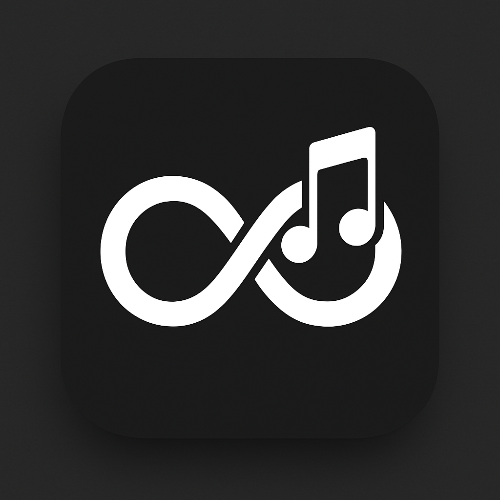

# Infinitum Music Activity

A cross-platform desktop application that shows your music activity (from Apple Music, Spotify, Amazon Music, etc.) on Discord and beyond. Features include Listen Along, multi-platform song links, scrobbling, and browser extension support.



## Features

- 🎵 **Multi-Platform Music Support**
  - Apple Music
  - Spotify
  - Amazon Music
  - YouTube Music
  - More coming soon!

- 🎮 **Discord Integration**
  - Rich Presence
  - Listen Along
  - Real-time status updates
  - Album art display

- 🎨 **Modern UI**
  - Clean, Apple-inspired design
  - Dark/Light mode support
  - Real-time music info
  - Interactive settings

- 🔧 **Advanced Features**
  - Auto-detection of music players
  - Cross-platform song links
  - Scrobbling support
  - Browser extension integration

## Installation

### Windows
1. Download the latest release from the [Releases page](https://github.com/yourusername/InfinitumMusicActivity/releases)
2. Choose the appropriate version:
   - `InfinitumMusicActivity-Setup-x64.exe` for 64-bit Windows
   - `InfinitumMusicActivity-Setup-x86.exe` for 32-bit Windows
3. Run the installer and follow the prompts

### macOS
1. Download the latest release from the [Releases page](https://github.com/yourusername/InfinitumMusicActivity/releases)
2. Choose the appropriate version:
   - `InfinitumMusicActivity-darwin-x64.dmg` for Intel Macs
   - `InfinitumMusicActivity-darwin-arm64.dmg` for Apple Silicon Macs
3. Mount the DMG and drag the app to your Applications folder

### Linux
1. Download the latest release from the [Releases page](https://github.com/yourusername/InfinitumMusicActivity/releases)
2. Choose the appropriate version:
   - `InfinitumMusicActivity-linux-x64.AppImage` for 64-bit Linux
   - `InfinitumMusicActivity-linux-arm64.AppImage` for ARM Linux
3. Make the AppImage executable: `chmod +x InfinitumMusicActivity-linux-x64.AppImage`
4. Run the AppImage

## Development

### Prerequisites
- Node.js 16 or later
- npm 7 or later
- Git

### Setup
1. Clone the repository:
   ```bash
   git clone https://github.com/yourusername/InfinitumMusicActivity.git
   cd InfinitumMusicActivity
   ```

2. Install dependencies:
   ```bash
   npm install
   ```

3. Build the project:
   ```bash
   npm run build
   ```

4. Start the development server:
   ```bash
   npm start
   ```

### Building for Production
```bash
# Build for all platforms
npm run build:all

# Build for specific platform
npm run build:win
npm run build:mac
npm run build:linux
```

## Configuration

### Discord Integration
1. Create a new application at [Discord Developer Portal](https://discord.com/developers/applications)
2. Copy your Client ID
3. Update the `clientId` in `src/index.ts`

### Music Services
The app automatically detects running music players. You can also manually enable/disable services:
1. Click the tray icon
2. Select your preferred music service
3. Toggle "Active" to enable/disable

## Troubleshooting

### Common Issues
1. **App not detecting music player**
   - Ensure your music player is running
   - Check if the service is enabled in the tray menu
   - Restart the app

2. **Discord Rich Presence not showing**
   - Verify Discord is running
   - Check your internet connection
   - Ensure the app is active in the tray

3. **Album art not displaying**
   - Check if "Show Album Art" is enabled in settings
   - Verify your music player is providing artwork
   - Try refreshing the app

## Contributing

1. Fork the repository
2. Create your feature branch (`git checkout -b feature/AmazingFeature`)
3. Commit your changes (`git commit -m 'Add some AmazingFeature'`)
4. Push to the branch (`git push origin feature/AmazingFeature`)
5. Open a Pull Request

## License

This project is licensed under the MIT License - see the [LICENSE](LICENSE) file for details.

## Acknowledgments

- [Electron](https://www.electronjs.org/)
- [Discord Rich Presence](https://discord.com/developers/docs/rich-presence/how-to)
- [Apple Music API](https://developer.apple.com/documentation/applemusicapi)
- [Spotify Web API](https://developer.spotify.com/documentation/web-api)

## Support

- [GitHub Issues](https://github.com/yourusername/InfinitumMusicActivity/issues)
- [Discord Server](https://discord.gg/your-server)
- Email: support@infinitumimagery.com

---

© 2025 Infinitum Imagery LLC. All rights reserved. 